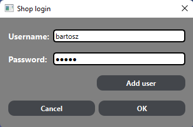
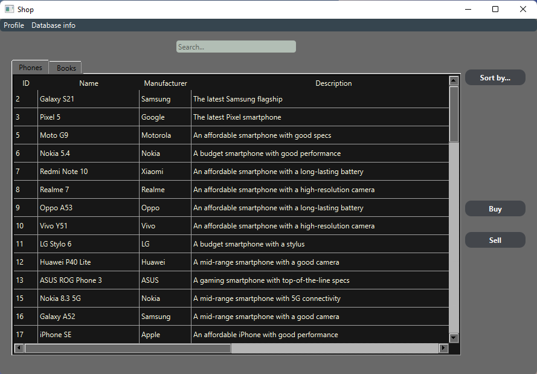
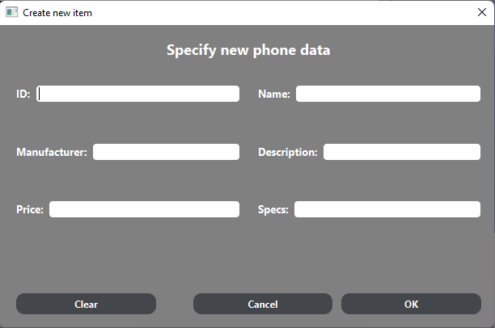
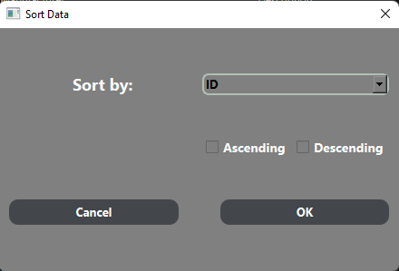

# Shop Project

This is project is a simple Shop where user can buy items. It handles different users
and their data such as username, password, amount of credits and history of purchases.
Shop's database is a separate .csv file The database is a class I created that reads and writes data to .csv files (each item has its own separate file).

GUI is created with Qt framework. Each window UI is modified with CSS like customization which Qt allows.

### Login window:

### Main window:

### Sell window:

### Sort window:

Main window contains search bar that user can use to look for items matching specific criteria (such as name, manufacturer etc).
There is also a sorting button that triggers new window allowing to specify order of sorting and the name of the column to sort by.

User can add new items buy clicking "Sell" button and can buy existing one by selecting it in the table and clicking "Buy" button.

User's profile is triggered by clicking "Profile" in menu bar. It allows to change password, add some credits and see the history of purchases. All of the user data is stored in binary file.

